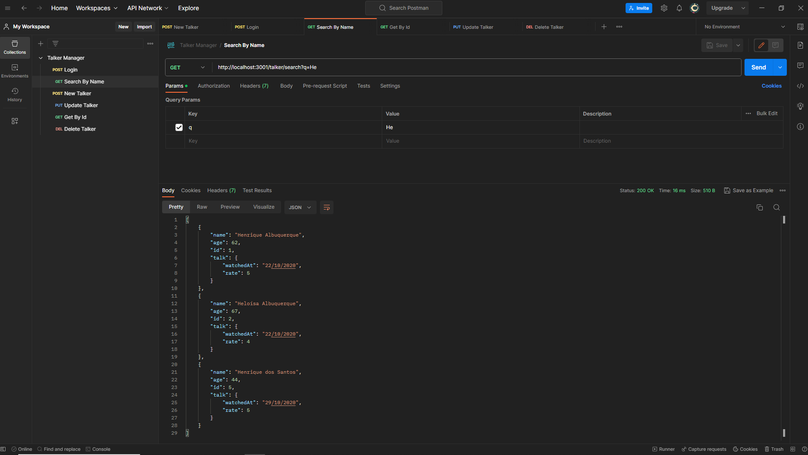

# Talker Manager



# Índice

* [Título e Imagens Home](#talker-manager)
* [tecnologias utilizadas](#tecnologias-utilizadas)
* [Descrição do projeto](#descrição-do-projeto)
* [Status do Projeto](#status-do-projeto)
* [Funcionalidade do projeto](#🔨-funcionalidade-do-projeto)
* [Acesso ao Projeto](#acesso-ao-projeto)
* [Rotas](#rotas)

# Tecnologias utilizadas


# Descrição do Projeto

O projeto "Talker Manager" é parte do currículo da formação de Desenvolvedor Web da [Trybe](https://www.betrybe.com/). Nesse projeto, os alunos têm a oportunidade de aplicar seus conhecimentos com a Linguagem JavaScript para criar um servidor Rest Full. 

# Status do Projeto

> 💹 Alpha 💹

# 🔨 Funcionalidade do projeto

- Fazer Login
- Busca Todos os Palestrante
- Fazer Busca por Nome do Palestrante
- Fazer Busca por Id do Palestrante
- Criar novo Palestrante
- Atualizar Palestrante
- Deleta Palestrante
- Todas as Funções exceto Login so é Feita Quando Passado Token pelo Header

# Acesso ao projeto

Para acessar e executar este projeto, siga os passos abaixo:

1. Certifique-se de ter o Node.js, npm e Docker instalados em sua máquina.

2. Clone o Projeto

```bash
git clone  TalkerManager
```

3. Entre no projeto

```bash
cd TalkerManager
```

4. inicie o projeto

```bash
docker-compose up -d
```

# Rotas

<details>
<summary><strong>Login</strong></summary>

faça login com user Admin para obter o Token para testa as demais rotas.

method ```POST```

Rota

```bash
http://localhost:3001/login
```

corpo da requisição
```json
{
  "email": "admin@admin.com",
  "password": "123456"
}
```
</details>

<details>
<summary><strong>Search By Name</strong></summary>

method ```GET```

Rota

```bash
http://localhost:3001/talker/search?q=He
```

Obs: O Token deve ser Passado pelo Header da Requisição.

</details>

<details>
<summary><strong>New Talker</strong></summary>

method ```POST```

Rota

```bash
http://localhost:3001/talker
```

corpo da requisição
```json
{
    "name": "Bruno",
    "age": 57,
    "talk": {
        "watchedAt": "22/10/2021",
        "rate": 4
    }
}
```

Obs: O Token deve ser Passado pelo Header da Requisição.
</details>

<details>
<summary><strong>Update</strong></summary>

method ```PUT```

Rota

```bash
http://localhost:3001/talker/6
```

corpo da requisição
```json
{
    "name": "Bruno Lopes",
    "age": 57,
    "talk": {
        "watchedAt": "22/10/2021",
        "rate": 4
    }
}
```

Obs: O Token deve ser Passado pelo Header da Requisição.
</details>

<details>
<summary><strong>Get By Id</strong></summary>

method ```GET```

Rota

```bash
http://localhost:3001/talker/6
```

Obs: O Token deve ser Passado pelo Header da Requisição.
</details>

<details>
<summary><strong>Delete</strong></summary>

method ```DELETE```

Rota

```bash
http://localhost:3001/talker/6
```

Obs: O Token deve ser Passado pelo Header da Requisição.
</details>